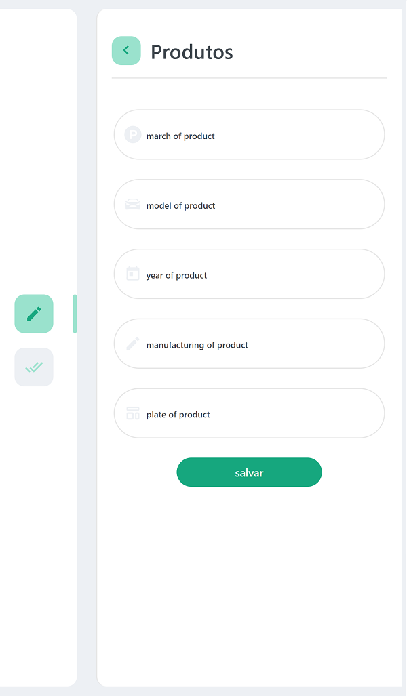
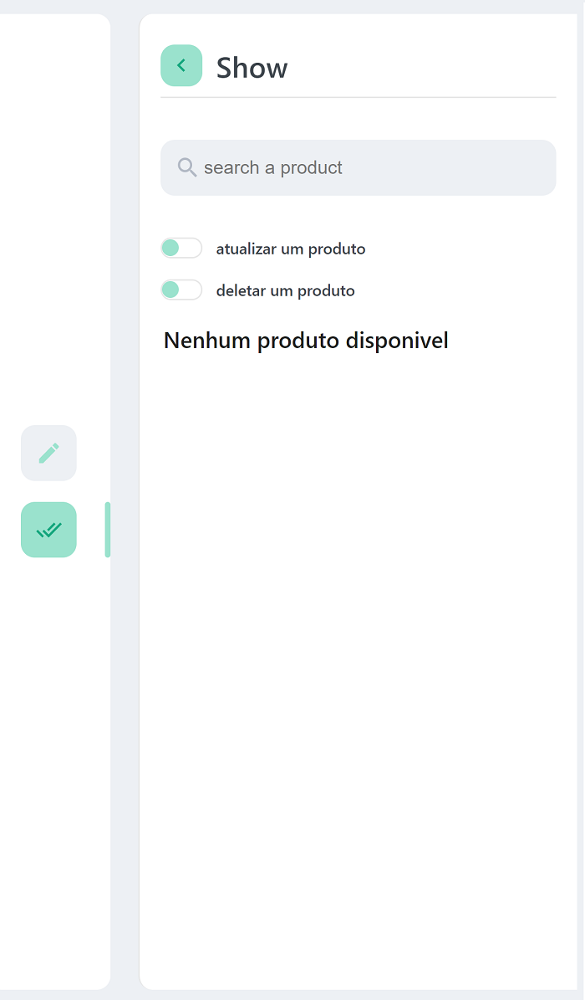

# 011Brasil - CRUD + Pedro Guilherme Faria Duarte

 

## Pré-Requisitos
Este projeto foi construido utilizando as seguintes tecnologias

1. [Node JS](https://chocolatey.org/packages/nodejs-lts)
2. [React JS](https://create-react-app.dev/docs/getting-started/)
3. [Mongo DB](https://chocolatey.org/packages/mongodb)
4. [Yarn](https://chocolatey.org/packages/yarn)

Certifique-se que seu ambiente de trabalho/desenvolvimento possui as tecnologias listada logo acima instaladas na sua maquina. 

Caso não tenha alguma das tecnologias instalada clique em seus nomes para você ser redirecionado para a pagina do gerênciador de pacotes do windows, **Chocolatey**, se preferir segue abaixo uma lista com links para o site oficial de cada tecnologia utilizada neste projeto.

1. [Node JS](https://nodejs.org/en/)
2. [Mongo DB](https://www.mongodb.com/)
3. [React JS](https://pt-br.reactjs.org/)
4. [Yarn](https://yarnpkg.com/)

Este projeto foi construido, testado e executado com as suas dependências nas seguintes versões:
  1. Node JS v14.14.4
  1. React JS v17.0.1
  1. MongoDB v4.4
  1. Yarn v1.22.4

## Começando

Para começar a usar este projeto, primeiro devemos instalar todas as suas depedências, vamos lá!

Este projeto está estruturado em duas pastas, **API** e **APP**, uma API e uma interface interativa respectivamente. Para instalar as dependências da API abra a pasta em um terminal de sua preferência e execute o seguinte comando:

```bash
  # YARN
  yarn install
  # OR
  npm install
```

*Aguarde o processo de instalação, pode demorar alguns minutos, principalmente na pasta seguinte*.

Finalizado a instalação da API, vamos agora instalar a interface (APP), repetindo os mesmos passos no processo de instalação da API, abra a pasta **app** em um terminal e execute o seguinte comando:

```bash
  # YARN
  yarn install
  # OR
  npm install
```

Legal **:D**, agora é so aguardar a instalação!

Com a instalação da API e APP finalizadas, vamos agora executar esses programas.

Para inicia a API, abra a pasta **API**  em um terminal e execute o seguinte comando:

```bash
  # YARN
  yarn onzebrasil:dev
  # OR
  npm onzebrasil:dev
```

Aguarde alguns segundos e você verá uma mensagem de log no terminal indicando oque está acontecendo em tempo real na API.

Com o **app** é o mesmo processo, com a diferença que ao invés de uma mensagem de log, ira abrir uma nova guia/janela no seu navegador/browser padrão.

## Entendendo a API

A api foi desenvolvida com base no padrão rest.

### Respostas

Todo respota da api vem estruturada em um objeto JSON com o seguinte  formato:

```js
{
  code: number,
  message: string,
  data: {} | []
}
```
### Entendendo o formato da resposta

Toda requisição efetuada terá na sua resposta um code, message e data.

**CODE**
<br>
O campo representa o HTTP STATUS CODE da requisição, com a diferença no modo uso, caso o conteudo solicitado na requisição não seja encontrado ou ocorra um erro fatal o code terá um HTTP STATUS CODE correspondente ou seja, caso seja solicitado um produto e ele não exista no banco de dados o code será *404*, caso venha ocorrer um erro fatal o status code será 500.
<br>
<br>
**MESSAGE**
<br>
Um texto correspondente ao retorno da requisição, pode ser desde *Product create with success* a *ValidationError*
<br>
<br>
**DATA**
<br>
O campo data pode vir com um objeto representado oque foi solicitado ou um array de objetos, por exemplo:

```json
 {
  "code": 200,
  "message": "All products found with success",
  "data": [
    {
      "_id": "604d8ce5c9af243644dffc52",
      "march": "BMW",
      "model": "M4 Sport",
      "year": 2020,
      "manufacturing": "Alemanha",
      "plate": "DRG-6932",
      "__v": 0
    },
    {
      "_id": "604d8e5ac9af243644dffc53",
      "march": "Audi",
      "model": "A4 Sport",
      "year": 2021,
      "manufacturing": "Alemanha",
      "plate": "DFG-0011",
      "__v": 0
    }
  ]
}
```

ou

```json
 {
  "code": 200,
  "message": "All products found with success",
  "data": 
    {
      "_id": "604d8ce5c9af243644dffc52",
      "march": "BMW",
      "model": "M4 Sport",
      "year": 2020,
      "manufacturing": "Alemanha",
      "plate": "DRG-6932",
      "__v": 0
    }  
}
```

### Realizando um requisição

Para realizar um requisição, basta utilizar um meio que permite a realização de requisições HTTP, recomendo o [Insomnia](https://insomnia.rest/).

Caso opte pelo Insomnia, importe este [arquivo](./insomnia/011brasil_api_test.json) no Insomnia, com isso todas as rotas e body's para as requisições estão prontas para os testes. Ou se preferir, realize os testes pelo **app**.

#### Rotas
As seguintes rotas são aceitas pela API.

1. **/product/create** (Para cadastrar um novo produto)
2. **/product/:idProduct** (Para Atualizar, Deletar e Consultar um produto)
3. **/product/update/:idProduct** (Para atualizar um produto)
4. **/product/delete/:idProduct** (Para deletar um produto)
5. **/product/show/:idProduct** (Para consultar um produto)
6. **/product/all/show** (Para consultar todos os produtos)

#### Entendendo as rotas

As rotas de forma geral aceitão os mesmo tipos de dados com exceção das rotas **6** e **2**.

*O dado em JSON deve ser passado no body da requisição e sempre em JSON*

*O idProduct é apenas um abstração para o id propriamente dito mas também para a march, model, manufacturing e plate, com a busca pelo produto podendo ser realizada utilizando umas das informações citadas acima *

**Para a rota numero *1* passamos o seguinte dado**: 
```json
{
  "march": "YOUR VALUE",
  "model": "YOUR VALUE",
  "year": "YOUR VALUE",
  "manufacturing": "YOUR VALUE",
  "plate": "YOUR VALUE"
}
```

**Para a rota numero *2*  podemos passar o seguinte dado**: 
```json
{
  "march": "YOUR VALUE",
  "model": "YOUR VALUE",
  "year": "YOUR VALUE",
  "manufacturing": "YOUR VALUE",
  "plate": "YOUR VALUE"
}
```
e também o ID do produto que deve conter 24 caracteres, mas este dado vai diretamente na rota:

```
  /product/YOUR ID PRODUCT
```

**Para a rota numero *3*  podemos passar o seguinte dado no corpo da requisição e também o ID do produto mas na rota**: 

```
  /product/update/YOUR ID PRODUCT
```

```json
{
  "march": "YOUR VALUE",
  "model": "YOUR VALUE",
  "year": "YOUR VALUE",
  "manufacturing": "YOUR VALUE",
  "plate": "YOUR VALUE"
}
```

**Para a rota numero *4*  passamos ID do produto mas na rota**: 
```
  /product/delete/YOUR ID PRODUCT
```

**Para a rota numero *5*  passamos ID do produto mas na rota**: 
```
  /product/show/YOUR ID PRODUCT
```

**Para a rota numero *6*  não precisamos passar nenhum parametro a mais**: 
```
  /product/all/show
```

Chegamos ao fim, com isso podemos ver que a API foca no CRUD de produtos e acabamos por aqui **:D**.

**Este projeto faz parte de um pratical test realizado pela 011brasil para o cargo de Programador Front-end, onde foi solicitado a criação de um sistema back-end em PHP + Lavaravel ou Node.JS + MongoDB para a realização do *CRUD* de veículos, a interface(app) foi um projeto a parte para complementar a realização dos testes da API.**