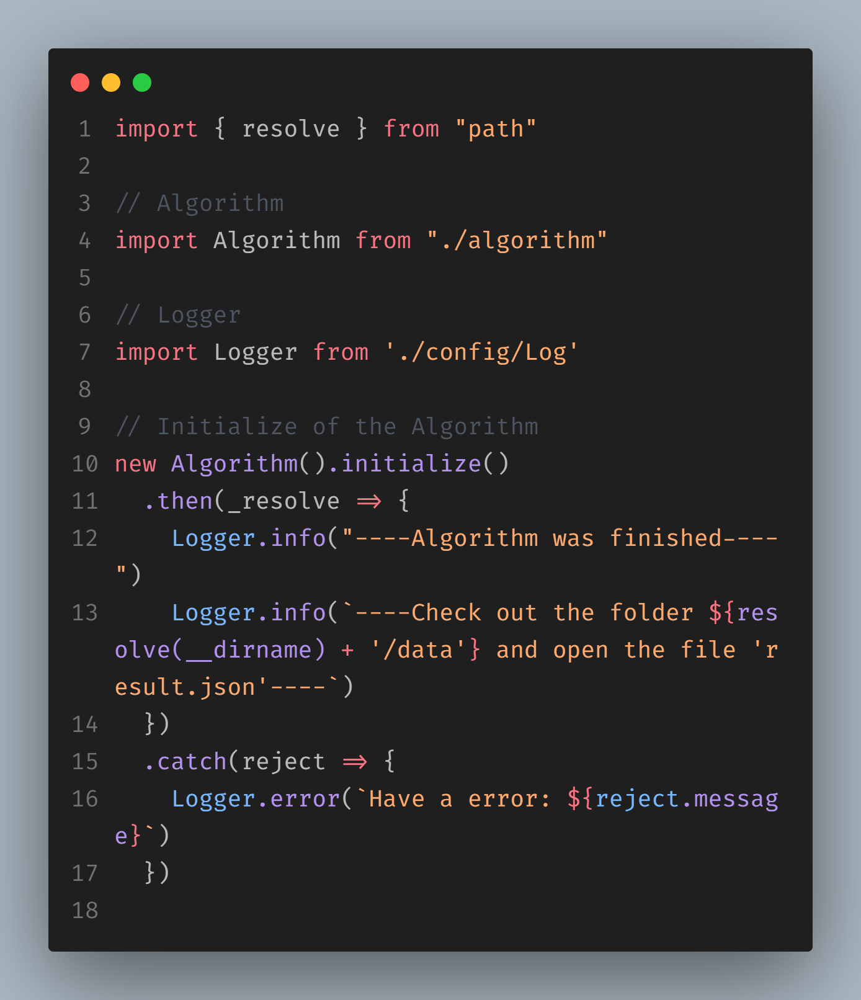

# 011Brasil - CRUD + Pedro Guilherme Faria Duarte

<p align="center">
  
</p>

<p align="center">
  <a href="#Pré-Requisitos">Pré-Requisitos</a>&nbsp;&nbsp;&nbsp;|&nbsp;&nbsp;&nbsp;
  <a href="#O algoritmo">O algoritmo</a>&nbsp;&nbsp;&nbsp;|&nbsp;&nbsp;&nbsp;
  <a href="#entendendo-as-etapas">Entendendo as etapas</a>&nbsp;&nbsp;&nbsp;|&nbsp;&nbsp;&nbsp;
  <a href="#instalando">Instalando</a>&nbsp;&nbsp;&nbsp;|&nbsp;&nbsp;&nbsp;
  <a href="#executando">Executando</a>&nbsp;&nbsp;&nbsp;|&nbsp;&nbsp;&nbsp;
  <p align="center">
  <a href="#visualizando-as-etapas">Visualizando as etapas</a>&nbsp;&nbsp;&nbsp;|&nbsp;&nbsp;&nbsp;
  </p>
  </p>

## Pré-Requisitos
Este projeto foi construido utilizando as seguintes tecnologias

1. [Node JS](https://chocolatey.org/packages/nodejs-lts)
4. [Yarn](https://chocolatey.org/packages/yarn)

Certifique-se que seu ambiente de trabalho/desenvolvimento possui as tecnologias listada logo acima instaladas na sua maquina. 

Caso não tenha alguma das tecnologias instalada clique em seus nomes para você ser redirecionado para a pagina do gerênciador de pacotes do windows, **Chocolatey**, se preferir segue abaixo uma lista com links para o site oficial de cada tecnologia utilizada neste projeto.

1. [Node JS](https://nodejs.org/en/)
4. [Yarn](https://yarnpkg.com/)

Este projeto foi construido, testado e executado com as suas dependências nas seguintes versões:
  1. Node JS **v15.12.0**
  2. Yarn **v1.22.4**

## 💻 O algoritmo

Este algoritmo foi construido para organizar em grupo uma lista de vacinação, os requisitos são os seguintes:
  1. Deve ser organizada em 4 grupos
  2. Maiores de 60 anos tem prioridade
  3. Atividades priorizadas: Saúde, Educação, Alimentícios e Segurança

Com isso em mente o fluxo de organização foi definido da seguinte forma:

  1ª **Separa todas as pessoas em grupos de quantidades iguais** 
  <br>
  2ª **Re-agrupa os items**
  <br>
  3ª **Orderna items de cada grupo**

Todo o fluxo é executado de maneira linear, tem inicio no primeiro item da lista e finaliza no ultimo, isso acontece em todas as etapas do fluxo.

## 🚀 Entendendo as etapas

Com o fluxo do algoritmo sendo dividido em três partes, vamos entender cada uma:
<br>
  1. Na primeira etapa a **lista de vacinação** é percorrida a partir do primeiro item até o ultimo, durante o processo é verificado se a pessoa tem uma idade superior a **60 anos** e se a area de atuação faz parte das atividades prioritárias, se sim, é verificado se o grupo 1 (grupoOne) possuí uma "vaga", caso a pessoa se enquadre na idade ela é adicionada no grupo 1 (grupoOne), em caso negativo, a pessoa será adicionada nos grupos seguintes que tiverem uma "vaga" aberta, caso nenhum grupo tenha vagas sobrando a pessoa não será adicionada em um grupo.
  
  2. Na segunda etapa em conjunto com a terceira, com a lista agora em grupos, ela vai ser tranformada em um array multidimensional (**o motivo disso é devido a forma com qual a organização em grupo foi estruturada, um objeto de array's**), este processo ordena cada grupo, com cada item do grupo sendo parcialmente ordenado em forma decrescente, com o fim da ordenação o resultado é **re-estruturado em um objeto de array's**.

Outras operações internas são executadas, mas as mesma não possuem nenhum papel de peso no fluxo principal, com execeção do metódo *addOnGroup* (Adicionar no grupo)

*As 1ª e 3ª etapas levam em consideração a idade da pessoa*

*A 1ª etapa também leva em consideração a area de atuação da pessoa*

## Instalando

Antes de executar, primeiro vamos instalar o algoritmo :D, abra um terminal de sua preferência e execute o seguinte comando:
```bash
  # YARN 
  yarn install
  # OR
  npm install
```

Aguarde a instalação, com ela conluido já podemos ir para a proxíma seção.

## Executando

Para iniciar o algoritimo certifique se os dados de entrada estão no arquivo **index.json** na pasta **src/data**.

Abra um terminal de sua preferência, acesse a pasta **./algorithm/Grouping** e execute o seguinte codigo:

```bash
  # YARN
  yarn 011brasil:init
  # OR
  npm 011brasil:init
```

## Visualizando as etapas

No terminal aberto na seção anterior, você verá uma serie de log's sendo exibido, cada log representa uma etapa no fluxo do algoritmo.

Após o termino do algoritmo um ultimo log será exibido, informando que a operação terminou e passando o link para acessar o resultado.